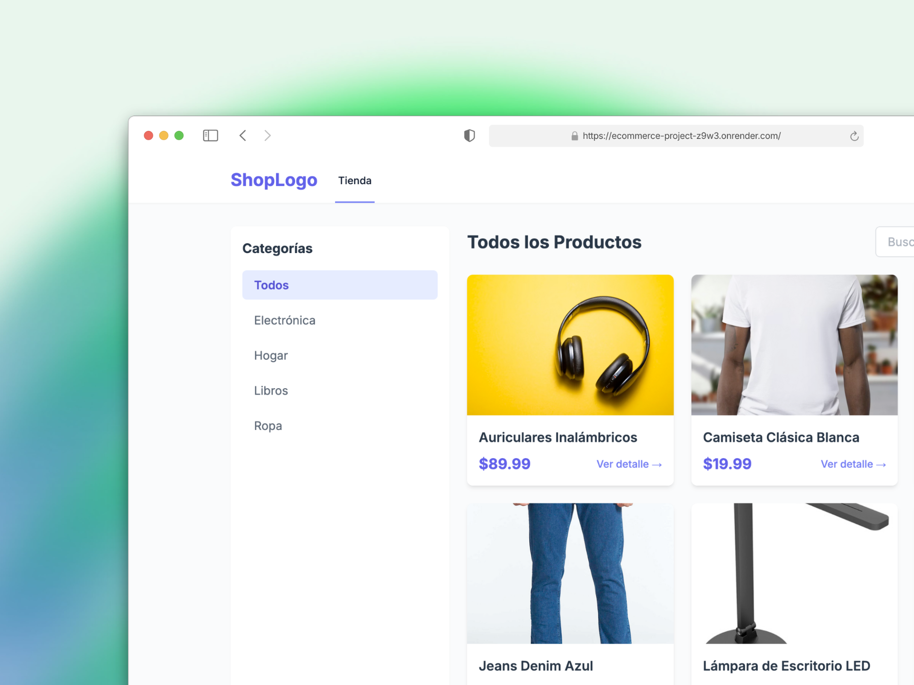

# Sistema de Carrito de Compras Django

Este proyecto es un sistema de comercio electrónico desarrollado con Django, completado exitosamente como parte del Trabajo Práctico de Análisis y Metodología de Sistemas.

**Demo desplegada**: [https://ecommerce-project-z9w3.onrender.com/](https://ecommerce-project-z9w3.onrender.com/)

## Objetivo Cumplido

El objetivo de desarrollar un sistema web de carrito de compras utilizando Django ha sido alcanzado, cumpliendo con todos los requerimientos funcionales y no funcionales solicitados:

-   **Gestión de Productos**: Listado, filtrado, búsqueda y detalle.
-   **Carrito de Compras**: Agregar, modificar, eliminar y persistir items.
-   **Gestión de Usuarios**: Registro, login, perfil y historial de compras.
-   **Proceso de Compra**: Checkout completo con simulación de pago y generación de órdenes.
-   **Documentación**: Diagramas de Casos de Uso, Clases, Secuencia y ER completos (ver carpeta `docs/`).

## Instalación y Ejecución

1.  Clonar el repositorio.
2.  Crear un entorno virtual:
    ```bash
    python3 -m venv venv
    source venv/bin/activate  # Linux/Mac
    venv\Scripts\activate     # Windows
    ```
3.  Instalar dependencias:
    ```bash
    pip install -r requirements.txt
    ```
4.  Aplicar migraciones:
    ```bash
    python manage.py migrate
    ```
5.  (Opcional) Cargar datos de prueba:
    ```bash
    python manage.py populate_db
    ```
6.  Ejecutar el servidor:
    ```bash
    python manage.py runserver
    ```

## Estructura del Proyecto

-   `config/`: Configuración principal del proyecto.
-   `store/`: Gestión de productos, categorías, reviews y wishlist.
-   `cart/`: Lógica del carrito de compras (basado en sesiones).
-   `users/`: Gestión de usuarios (registro, login, perfil, historial).
-   `orders/`: Gestión de órdenes de compra.
-   `coupons/`: Sistema de cupones de descuento.
-   `payment/`: Integración con pasarelas de pago (simulado/MercadoPago).
-   `docs/`: Documentación y diagramas (Mermaid).

## Decisiones de Diseño

-   **Carrito en Sesión**: Se optó por persistir el carrito en la sesión del usuario para permitir compras sin registro previo (guest checkout) y mejorar el rendimiento.
-   **Usuarios**: Se extendió el modelo `User` de Django mediante un modelo `Profile` (OneToOne) para almacenar dirección y teléfono.
-   **Búsqueda**: Implementada con consultas `Q` para filtrar por nombre y descripción.
-   **Frontend**: Se utilizó Tailwind CSS (vía CDN) para un diseño rápido y responsive, extendiendo la plantilla base.

## Testing

Se incluyen más de 20 tests unitarios que validan la funcionalidad core del sistema. Para ejecutarlos:
```bash
python manage.py test
```
